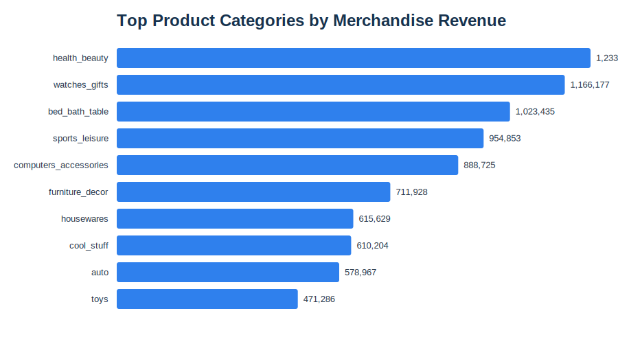
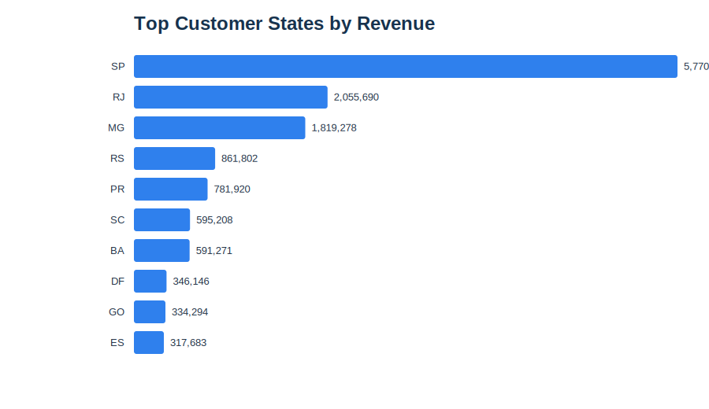

# Customer Retention & Revenue Intelligence

An end-to-end data analyst portfolio project using the Brazilian Olist ecommerce dataset. The project turns raw order, customer, product, payment, and review data into SQL models, dashboard-ready datasets, and business recommendations focused on revenue growth and customer retention.

## Business Problem

The business wants to understand why most customers do not return after their first order, which products and regions drive revenue, and where retention efforts should be prioritised. This project answers those questions with a reproducible SQL-style workflow and stakeholder-friendly outputs.

## Tools Used

- SQL / SQLite for data modelling and KPI queries
- Python standard library for repeatable CSV ingestion and exports
- Tableau-ready CSV outputs for dashboard building
- GitHub documentation for portfolio presentation

## Dataset

The raw data is the Olist ecommerce dataset, stored in `archive 2/`. It includes customers, orders, order items, payments, reviews, products, sellers, and product category translations.

## Key Results

| KPI | Result |
| --- | ---: |
| Total revenue | 15,422,461.77 |
| Delivered orders | 96,478 |
| Unique customers | 93,358 |
| Average order value | 159.85 |
| Repeat purchase rate | 3.00% |
| Inactive / churn-risk customers | 59.05% |

## Main Insights

1. Repeat purchasing is very low at 3.00%, which suggests Olist behaves more like a one-time purchase marketplace than a naturally recurring retail business.
2. 59.05% of customers are inactive or at churn risk under the 180-day inactivity definition, making lifecycle marketing and post-purchase engagement the biggest opportunity.
3. Sao Paulo is the largest revenue market, with 5.77M in revenue from 40,501 delivered orders.
4. The highest-revenue product categories are health and beauty, watches and gifts, bed bath table, sports leisure, and computers accessories.
5. Revenue is concentrated in large states and high-volume categories, so retention initiatives should start where customer density is highest before expanding nationally.

## Repository Structure

```text
archive 2/                     Raw Olist CSV files
data/processed/                Analysis-ready CSV outputs
docs/                          Business context, data dictionary, and recommendations
reports/figures/               Lightweight SVG charts for GitHub preview
scripts/build_analysis_outputs.py
sql/                           SQL workflow from raw tables to dashboard outputs
tableau/                       Tableau build notes and dashboard placeholder folder
```

## How To Reproduce

Run the build script from the repository root:

```bash
python3 scripts/build_analysis_outputs.py
```

The script creates a local SQLite database at `data/olist_retention.db` and exports the portfolio datasets to `data/processed/`. The database is intentionally ignored by Git because it is generated and exceeds a practical GitHub file size.

## Dashboard-Ready Outputs

- `data/processed/tableau_dashboard_orders.csv`: order-level dashboard dataset
- `data/processed/customer_segments.csv`: customer-level retention and value segmentation
- `data/processed/cohort_retention.csv`: monthly cohort retention table
- `data/processed/monthly_revenue.csv`: revenue, order, and customer trend metrics
- `data/processed/category_performance.csv`: product category performance
- `data/processed/state_performance.csv`: regional performance by Brazilian state

## Example Visuals





## Business Recommendations

1. Launch post-purchase retention journeys for high-volume states, especially Sao Paulo, Rio de Janeiro, and Minas Gerais.
2. Prioritise cross-sell campaigns in top categories such as health and beauty, watches and gifts, and bed bath table.
3. Build targeted win-back campaigns for customers inactive for more than 180 days.
4. Improve customer experience in lower-review markets and categories before scaling retention spend.
5. Track repeat purchase rate, cohort retention, and customer lifetime value as monthly executive KPIs.


